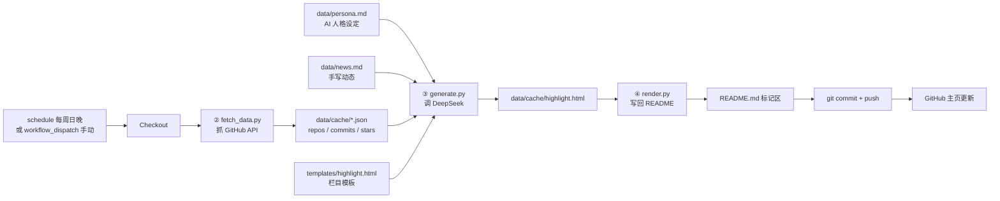

# AGENTS.md

> 本文件面向**将要操作本仓库的 AI agent**。读完它，你就知道这套系统是什么、怎么跑、怎么改，以及哪些红线不能碰。

## 1. 这是什么

这是一个 **GitHub 主页（同名 profile 仓库）的自动更新系统**：

- 用一个 **GitHub Actions 定时工作流**（每周日晚）抓取 GitHub 数据 + 主人手写的 News 素材；
- 用一个 **AI 数字分身人格**（基于 DeepSeek 大模型）把数据改写成第一人称、有口吻的 HTML 段落；
- 把结果渲染进 `README.md` 顶部的一个 **HTML 栏目**（GitHub 原生风格：标题 + 自然语言段落，不用列表、不用自定义样式）。

## 2. 架构线路图



## 3. 目录结构

```text
yanboc/
├── README.md                        # 主页（含一对自动生成标记，见 §4）
├── AGENTS.md                        # 本文件
├── .github/workflows/update-profile.yml   # 定时/手动触发的工作流
├── scripts/
│   ├── fetch_data.py                # 抓 GitHub API → data/cache/*.json（含缓存回退）
│   ├── generate.py                  # 组装 prompt → 调 DeepSeek → 生成 HTML
│   └── render.py                    # 把 HTML 写回 README 标记区 + 更新日期
├── data/
│   ├── news.md                      # 【主人手写】个人动态素材（AI 只润色，不发明）
│   ├── persona.md                   # AI 数字分身人格（系统提示词）
│   └── cache/                       # 抓取 + 生成缓存（已被 gitignore，勿提交）
└── templates/
    └── highlight.html               # 高亮栏目模板，含 {{CONTENT}} 槽位
```

## 4. README.md 里的标记区（关键，勿手改）

`README.md` 中有一对 HTML 注释围成的**自动生成区间**：

```html
<!-- PROFILE-HIGHLIGHT:START -->

<!-- PROFILE-HIGHLIGHT:END -->
```

- 这两个标记之间的内容由 `render.py` 每次运行**整体替换**；
- **不要手工编辑标记区中间的内容**——改了也会在下一次运行被覆盖；
- 标记区之外（研究经历、论文、项目列表等）可以正常手工维护。

## 5. AI 能力从哪来（重要认知）

**本仓库不包含任何本地或自托管的 AI 模型。** AI 能力完全来自一次对 **DeepSeek 云端大模型** 的 HTTP 调用：

- 接口：`https://api.deepseek.com/chat/completions`（OpenAI 兼容）
- 模型：`deepseek-chat`
- 鉴权：`DEEPSEEK_API_KEY`（存在 GitHub Secrets，见 §7）

AI 只做一件事：把「仓库数据 + 手写 news」改写成有人格味道的 HTML **段落**。它**不会主动上网、不会自动发现主人的动态**——所有事实信息必须由以下两个输入端提供：

| 输入端 | 谁维护 | 用在哪 |
|--------|--------|--------|
| GitHub API 数据（repos/commits/stars） | 自动抓取 | 「近期动态」栏目 |
| `data/news.md` | **主人手工写** | 揉进同一段叙述（AI 只负责润色） |

## 6. 数据流四步

1. **Fetch** `scripts/fetch_data.py` —— 调 GitHub REST API，抓仓库（过滤 fork）、Top 8 仓库的最新 commit、最近 star 的 20 个仓库；写 `data/cache/*.json`。**网络失败自动回退读缓存**，保证 workflow 不崩。
2. **Generate** `scripts/generate.py` —— 数据摘要 + `news.md` 拼成 prompt，连同 `persona.md` 发 DeepSeek，要求只输出一个带标记的 HTML 片段（`CONTENT`，1-2 段自然语言散文），填进 `templates/highlight.html` 的槽位，产出 `data/cache/highlight.html`。
3. **Render** `scripts/render.py` —— 用正则替换 `README.md` 标记区内容，并更新顶部 `> Last updated: ...` 日期。
4. **Push** —— `git commit + push`。

## 7. Secrets 配置（安全红线）

- `DEEPSEEK_API_KEY`：存**仓库 Settings → Secrets and variables → Actions**，workflow 通过 `${{ secrets.DEEPSEEK_API_KEY }}` 注入。
- `GITHUB_TOKEN`：GitHub 每次 run 自动注入，**无需手动配置**；`permissions: contents: write` 已在 workflow 声明。
- **禁止**把任何 key 写进 `*.yml`、`*.py`、`.env` 并提交进 git。一旦 key 进过 git 历史，必须去 DeepSeek 后台**吊销并重发**，而不是删除字段。
- 本地测试用一次性环境变量，不要写进文件：

```bash
cd /Users/apple/Documents/yanboc
DEEPSEEK_API_KEY='sk-xxxx' python3 scripts/generate.py
```

## 8. 如何手动触发更新

两种方式，任选：

- 自动：工作流每周日 12:23 UTC（北京时间周日 20:23）跑；
- 手动：GitHub 仓库页 → Actions → Update Profile → Run workflow。

主人想让主页有新的动态时：**先编辑 `data/news.md`，再手动触发一次**即可（news 会被 AI 揉进叙述段落）。

## 9. 本地运行完整链路

```bash
cd /Users/apple/Documents/yanboc

# 1. 抓数据（需要网络）
python3 scripts/fetch_data.py

# 2. 生成（需要 DEEPSEEK_API_KEY）
DEEPSEEK_API_KEY='sk-xxxx' python3 scripts/generate.py

# 3. 写回 README
python3 scripts/render.py
```

依赖只有 `requests`（`pip install requests`）。

## 10. Agent 操作规则清单

- ✅ 改个人动态：编辑 `data/news.md`（每行一条，最新在上，中英文皆可）。
- ✅ 调整人格：编辑 `data/persona.md`（system prompt，英文）。
- ✅ 调整栏目样式：编辑 `templates/highlight.html`（注意保留 `{{CONTENT}}` 槽位）。
- ✅ 改抓取逻辑/频率：编辑 `scripts/` 与 `.github/workflows/update-profile.yml`。
- ❌ **不要手工编辑 README 标记区内部**的内容。
- ❌ **不要在 README 标记区之外插入会被下一次渲染破坏的结构**。
- ❌ **不要把 API key 写进任何会被提交的文件**。
- ⚠️ 运行 `render.py` 会改动 README 顶部日期——这是预期行为，不要误当 bug。
- ⚠️ 修改 `news.md` 后手动触发 workflow，别期待 AI 自动知道你改了它。

## 11. 给维护者的一句话

想让主页「活」起来，核心是主人持续往 `news.md` 补真实动态（论文、会议、项目进展）。AI 只是润色秘书，不是新闻记者。
