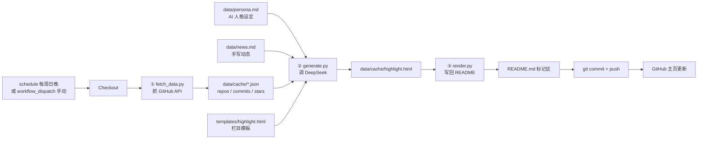

# AGENTS.md

> 本文件面向**将要操作本仓库的 AI agent**。读完它，你就知道这套系统是什么、怎么跑、怎么改，以及哪些红线不能碰。

## 1. 这是什么

这是一个 **GitHub 主页（同名 profile 仓库 `yanboc/yanboc`）的自动更新系统**：

- 用一个 **GitHub Actions 定时工作流**（每周日晚）抓取 GitHub 数据 + 人工手写的 News 素材；
- 用一个 **AI 数字分身人格**（基于 DeepSeek 大模型）把数据改写成第一人称、有口吻的 HTML 段落；
- 把结果渲染进 `README.md` 顶部的一个 **HTML 栏目**（GitHub 原生风格：标题 + 自然语言段落，不用列表、不用自定义样式）。

仓库没有应用代码、没有构建产物；全部逻辑就是 3 个 Python 脚本 + 1 个 workflow + 若干数据/模板文件。

## 2. 架构线路图


```mermaid
flowchart LR
    Sched["schedule 每周日晚<br/>或 workflow_dispatch 手动"] --> Chk[Checkout]
    Chk --> Fetch["① fetch_data.py<br/>抓 GitHub API"]
    Fetch --> Cache["data/cache/*.json<br/>repos / commits / stars"]
    Persona["data/persona.md<br/>AI 人格设定"] --> Gen["② generate.py<br/>调 DeepSeek"]
    News["data/news.md<br/>手写动态"] --> Gen
    Cache --> Gen
    Gen --> Html["data/cache/highlight.html"]
    Tmpl["templates/highlight.html<br/>栏目模板"] --> Gen
    Html --> Render["③ render.py<br/>写回 README"]
    Render --> Readme["README.md 标记区"]
    Readme --> Push["git commit + push"]
    Push --> Home[GitHub 主页更新]
```

## 3. 目录结构

```text
yanboc/
├── README.md                        # 主页（含一对自动生成标记，见第 4 节）
├── AGENTS.md                        # 本文件
├── .github/workflows/update-profile.yml   # 定时/手动触发的工作流
├── scripts/
│   ├── fetch_data.py                # 抓 GitHub API → data/cache/*.json（含缓存回退）
│   ├── generate.py                  # 组装 prompt → 调 DeepSeek → 生成 HTML
│   └── render.py                    # 把 HTML 写回 README 标记区 + 更新日期
├── data/
│   ├── news.md                      # 【人工手写】个人动态素材（AI 只润色，不发明）
│   ├── persona.md                   # AI 数字分身人格（system prompt，英文）
│   └── cache/                       # 抓取 + 生成缓存（已被 gitignore，勿提交）
└── templates/
    └── highlight.html               # 高亮栏目模板，含 {{CONTENT}} 槽位（标题/副标题为英文）
```

## 4. README.md 里的标记区（关键，勿手改）

`README.md` 中有一对 HTML 注释围成的**自动生成区间**：

```html
<!-- PROFILE-HIGHLIGHT:START -->

<!-- PROFILE-HIGHLIGHT:END -->
```

- 这两个标记之间的内容由 `render.py` 每次运行**整体替换**（正则为非贪婪 DOTALL 匹配）；
- **不要手工编辑标记区中间的内容**——改了也会在下一次运行被覆盖；
- 标记区之外（自我介绍、研究经历、论文、联系方式等）可以正常手工维护；
- `render.py` 找不到这对标记时会以退出码 2 报错退出，不会写坏 README。

## 5. AI 能力从哪来（重要认知）

**本仓库不包含任何本地或自托管的 AI 模型。** AI 能力完全来自一次对 **DeepSeek 云端大模型** 的 HTTP 调用（`scripts/generate.py` 中的 `call_llm`）：

- 接口：`https://api.deepseek.com/chat/completions`（OpenAI 兼容，可用环境变量 `DEEPSEEK_ENDPOINT` 覆盖）
- 模型：`deepseek-chat`（可用环境变量 `DEEPSEEK_MODEL` 覆盖）
- 采样参数：`temperature: 0.7`，超时 120 秒
- 鉴权：`DEEPSEEK_API_KEY`（存在 GitHub Secrets，见第 7 节）

AI 只做一件事：把「仓库数据 + 手写 news」改写成有人格味道的 HTML **段落**。它**不会主动上网、不会自动发现新动态**——所有事实信息必须由以下两个输入端人工提供：

| 输入端 | 谁维护 | 用在哪 |
|--------|--------|--------|
| GitHub API 数据（repos/commits/stars） | 自动抓取 | 「Recent Highlights」栏目 |
| `data/news.md` | **人工手写** | 揉进同一段叙述（AI 只负责润色） |

## 6. 数据流三步 + 推送

1. **Fetch** `scripts/fetch_data.py` —— 调 GitHub REST API（`X-GitHub-Api-Version: 2022-11-28`）：抓本人仓库（过滤 fork、按 `pushed_at` 倒序）、Top N（默认 `TOP_N=8`，可用环境变量覆盖）个最近更新仓库各自最新 1 条 commit、最近 star 的 20 个仓库；写 `data/cache/{repos,commits,stars}.json`。遇到 403 且带 `X-RateLimit-Reset` 时最多等 60 秒重试一次。**任何网络异常都会打印错误并回退读已有缓存**，仅当连 `repos.json` 缓存都不存在时才以退出码 1 失败。注意：`data/cache/` 被 gitignore，CI 每次运行都是空缓存，回退机制主要对本地反复调试有意义。
2. **Generate** `scripts/generate.py` —— 把前 10 个仓库（含最新 commit 摘要）、前 10 个 star、`news.md` 原文拼成 user prompt，连同 `persona.md`（system prompt）发给 DeepSeek，要求只输出 `<!-- CONTENT:START --> ... <!-- CONTENT:END -->` 包裹的 1-2 段散文（只许 `p/a/b/i` 标签，禁列表、禁样式、禁图片）。抽取标记内容（缺标记直接报错），填进 `templates/highlight.html` 的 `{{CONTENT}}` 槽位（模板缺槽位也报错），产出 `data/cache/highlight.html`。
3. **Render** `scripts/render.py` —— 用正则替换 `README.md` 标记区内容，并把顶部 `> Last updated: ...` 行更新为当天 UTC 日期（格式如 `Oct 02, 2026`，即 `strftime("%b %d, %Y")`）。`highlight.html` 不存在时按空内容处理（即清空标记区）。
4. **Push** —— workflow 里 `git add README.md`，`git diff --cached --quiet || git commit -m "chore: update profile highlights [skip ci]"`，无变化则不提交；以 `github-actions[bot]` 身份 push。

## 7. 环境变量与 Secrets（安全红线）

脚本读取的环境变量：

| 变量 | 用途 | 默认值 |
|------|------|--------|
| `DEEPSEEK_API_KEY` | DeepSeek 鉴权（**必填**，缺失时报错） | 无 |
| `DEEPSEEK_ENDPOINT` | 覆盖 API 地址 | `https://api.deepseek.com/chat/completions` |
| `DEEPSEEK_MODEL` | 覆盖模型名 | `deepseek-chat` |
| `GITHUB_TOKEN` | GitHub API 鉴权（可选，不带则走匿名限流） | 空 |
| `GITHUB_USER` | 抓取目标用户 | `yanboc` |
| `TOP_N` | 抓最新 commit 的仓库个数 | `8` |

安全红线：

- `DEEPSEEK_API_KEY`：存**仓库 Settings → Secrets and variables → Actions**，workflow 通过 `${{ secrets.DEEPSEEK_API_KEY }}` 注入。
- `GITHUB_TOKEN`：GitHub 每次 run 自动注入，**无需手动配置**；`permissions: contents: write` 已在 workflow 声明。
- **禁止**把任何 key 写进 `*.yml`、`*.py`、`.env` 并提交进 git。一旦 key 进过 git 历史，必须去 DeepSeek 后台**吊销并重发**，而不是删除字段。
- 本地测试用一次性环境变量，不要写进文件：

```bash
cd <本机 yanboc 仓根目录>
DEEPSEEK_API_KEY='sk-xxxx' python3 scripts/generate.py
```

## 8. 如何触发更新

- 自动：工作流每周日 12:23 UTC（北京时间周日 20:23，cron `23 12 * * 0`）跑；
- 手动：GitHub 仓库页 → Actions → Update Profile → Run workflow。

workflow 设有 `concurrency: profile-update-${{ github.ref }}`（`cancel-in-progress: false`），同一分支的多次触发会排队而非并发。想让主页有新动态时：**先编辑 `data/news.md`，再手动触发一次**即可。

## 9. 本地运行完整链路

```bash
cd <本机 yanboc 仓根目录>

# 1. 抓数据（需要网络；GITHUB_TOKEN 可选）
python3 scripts/fetch_data.py

# 2. 生成（需要 DEEPSEEK_API_KEY）
DEEPSEEK_API_KEY='sk-xxxx' python3 scripts/generate.py

# 3. 写回 README
python3 scripts/render.py
```

- 运行时依赖只有 `requests`（`pip install requests`）；无 `requirements.txt` / `pyproject.toml`，CI 用 Python 3.12（`actions/setup-python@v5`）。
- 仓库**没有测试套件、没有 lint 配置**；改动脚本后请按上面三步在本地完整跑一遍验证（第 2 步会产生一次真实的 DeepSeek API 调用）。

## 10. 代码风格约定

- 脚本均为标准库 + `requests` 的单文件 Python，无类、无框架，函数以 `_` 前缀表私有；
- 路径一律用 `os.path` 基于脚本位置推导（`ROOT = dirname(dirname(abspath(__file__)))`），可从任意 cwd 运行；
- 日志用 `print("[脚本名] ...")`，警告/错误走 `stderr`；
- JSON 缓存统一 `ensure_ascii=False, indent=2`；
- 生成给 AI 的 prompt 用英文；`persona.md` 用英文；`templates/highlight.html` 用英文；`news.md` 中英文皆可；文档（本文件）用中文。

## 11. Agent 操作规则清单

- ✅ 改个人动态：编辑 `data/news.md`（每行一条，最新在上，中英文皆可；文件顶部的 HTML 注释是写给人的说明）。
- ✅ 调整人格：编辑 `data/persona.md`（system prompt，英文）。
- ✅ 调整栏目样式：编辑 `templates/highlight.html`（注意保留 `{{CONTENT}}` 槽位）。
- ✅ 改抓取逻辑/频率：编辑 `scripts/` 与 `.github/workflows/update-profile.yml`。
- ❌ **不要手工编辑 README 标记区内部**的内容。
- ❌ **不要在 README 标记区之外插入会被下一次渲染破坏的结构**（尤其不要动 `> Last updated:` 那一行的格式，`render.py` 靠正则 `> Last updated: .*` 匹配它）。
- ❌ **不要把 API key 写进任何会被提交的文件**。
- ⚠️ 运行 `render.py` 会改动 README 顶部日期——这是预期行为，不要误当 bug。
- ⚠️ 修改 `news.md` 后要手动触发 workflow，别期待 AI 自动知道你改了它。
- ⚠️ `data/cache/` 不要提交（已在 `.gitignore`）。

## 12. RULES.md：开发习惯权威记录（公开）

`RULES.md` 是**开发流程习惯的权威记录（公开版）**，随本仓 git 同步到所有机器。

- 只放**可公开的、流程类**内容；个人/敏感信息（身份、雇主、账号、内网、本机路径）**禁止写入**，那些在本机私有文档里。
- **写入前和 push 前都要过敏感检查**——进 git 历史即永久公开。
- 本文件自包含，不引用仓外路径。
- 新增/修改规则走 RULES.md 里「规则固化流程」六步（落盘 → 登记待办 → 人类助手确认后 push → 投影到各 harness → 闭环）。

## 13. 给维护者的一句话

想让主页「活」起来，核心是持续人工往 `news.md` 补真实动态（论文、会议、项目进展）。AI 只是润色秘书，不是新闻记者。
